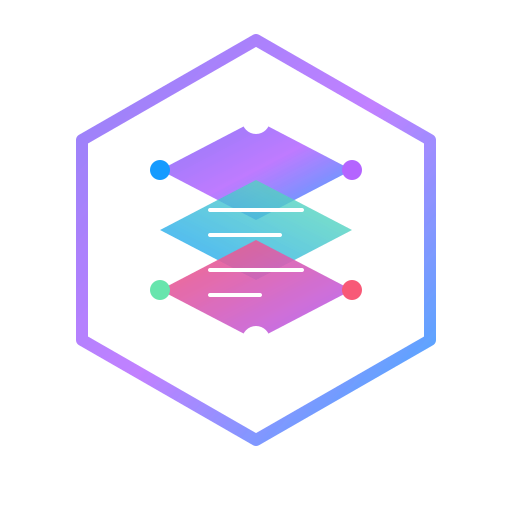
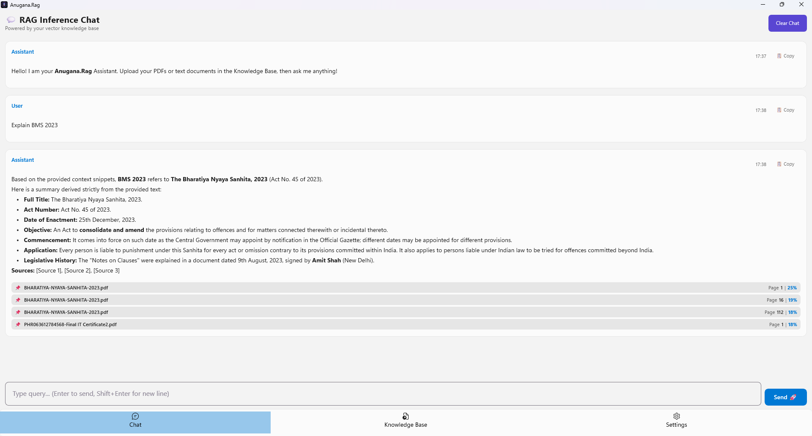
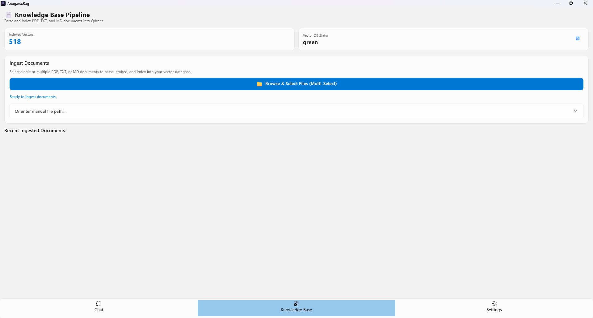
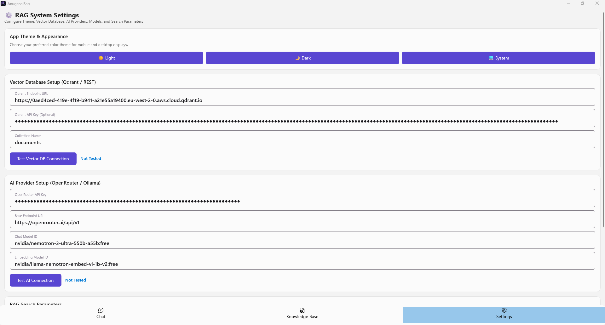

# Anugana.Rag 🚀

<div align="center">
  
  <h3>Cross-Platform Retrieval-Augmented Generation (RAG) AI Assistant</h3>
  <p>Powered by <b>Uno Platform</b>, <b>.NET 10</b>, <b>Qdrant Vector Database</b>, and <b>OpenRouter AI</b>.</p>

  <p>
    <a href="https://github.com/avikeid2007/Anugana/actions"></a>
    <a href="https://platform.uno"></a>
    <a href="https://dotnet.microsoft.com/"></a>
    <a href="https://qdrant.tech"></a>
    <a href="https://openrouter.ai"></a>
    <a href="LICENSE.txt"></a>
  </p>
</div>

---

## 🌟 Overview

**Anugana.Rag** is a modern, high-performance, cross-platform AI desktop and mobile application that brings document intelligence directly to your device. Upload PDFs, text files, or markdown documents into your personal vector knowledge base and converse with an AI assistant that answers questions using exact context snippets from your documents.

---

## 🧠 What is an Embedding Model & Why is it Used?

An **Embedding Model** is an AI model that converts human text into a mathematical array of numbers called a **Vector** (e.g. `[0.024, -0.158, 0.892, ...]`).

### How Embeddings Power RAG:
1. **Semantic Meaning**: Embeddings capture the conceptual meaning of words, not just exact keyword matches. For example, the text *"automobile"* and the query *"car"* produce vectors that are mathematically very close.
2. **Indexing (Knowledge Base)**: When you upload a document, Anugana.Rag breaks it into text chunks and sends each chunk to the **Embedding Model** to generate a vector. These vectors are saved into **Qdrant Vector Database**.
3. **Retrieval (Chat)**: When you ask a question, your query is converted into a vector by the same Embedding Model. Qdrant compares your query vector against all document vectors to instantly find the **most relevant text snippets** for the LLM to read and answer from.

---

## 🔑 How to Get FREE Access Keys & Free Models

Anugana.Rag works out of the box with **100% Free Tier Cloud Providers** so you can start querying your documents without spending a dime!

### 1. 🗄️ Free Qdrant Vector DB Cloud (Free Forever 1GB Cluster)
Qdrant offers a generous **Free Forever** cloud cluster with 1GB storage (enough for tens of thousands of document vectors):
1. Sign up at [https://cloud.qdrant.io](https://cloud.qdrant.io).
2. Click **Create Cluster** → choose the **Free Tier (1GB RAM)**.
3. Once created, copy your **Cluster URL** (e.g. `https://xxx.cloud.qdrant.io`) and **API Key**.
4. Paste them into **Anugana.Rag Settings** under *Qdrant Endpoint URL* and *API Key*.

### 2. 🤖 Free OpenRouter API Key & Free Models
OpenRouter provides access to top-tier LLMs and embeddings with **completely free models**:
1. Sign up at [https://openrouter.ai](https://openrouter.ai).
2. Go to **Keys** → click **Create Key** (no credit card required).
3. Copy your API Key and paste it into **Anugana.Rag Settings** under *OpenRouter API Key*.

#### 🆓 Free AI Chat Models (Set in Settings under *Chat Model ID*):
- `openrouter/free` *(Auto-selects the best available free model)*
- `nvidia/nemotron-3-ultra-550b-a55b:free`
- `google/gemma-4-31b-it:free`
- `google/gemma-4-26b-a4b-it:free`
- `openai/gpt-oss-20b:free`
- `poolside/laguna-m.1:free`

#### 🆓 Free Embedding Models (Set in Settings under *Embedding Model ID*):
- `nvidia/llama-nemotron-embed-vl-1b-v2:free`
- `nvidia/nemotron-3-embed-1b:free`
- `openai/text-embedding-3-small` *(High precision default option)*

---

## 📱 App Feature Guide & Screenshots

Anugana.Rag features an intuitive 3-tab navigation bar at the bottom:

### 💬 1. RAG Inference Chat
- **Ask Anything**: Type your query into the input bar and press `Enter` to send (or `Shift + Enter` for a new line).
- **Thinking Indicator**: Watch the `🤔 Searching knowledge base & thinking...` indicator as your vector DB is queried.
- **Real-Time Markdown**: Answers stream in live with code blocks, bold text, lists, and formatted headings.
- **Copy Response**: Click the `📋 Copy` button on any response card for instant clipboard copy (`✅ Copied!`).
- **Source Citations**: Every answer lists the exact source file, page number, and vector relevance score (`📌 manual.pdf | Page 2 | Relevance: 92%`).

<br/>
<div align="center">
  
</div>
<br/>

---

### 📄 2. Knowledge Base (Document Ingestion)
- **Multi-File Picker**: Click **`📁 Browse & Select Files (Multi-Select)`** to choose multiple `.pdf`, `.txt`, or `.md` files at once.
- **Automatic Page Chunking**: Documents are split into overlapping text chunks, embedded, and stored into Qdrant automatically.
- **Real-Time Progress**: Track processing status for each document in your batch (`⏳ [1/3] document.pdf: Indexing vectors...`).
- **Database Stats**: View total indexed vector count and connection status at a glance.

<br/>
<div align="center">
  
</div>
<br/>

---

### ⚙️ 3. Settings & Configuration
- **App Theme Switcher**: Toggle between ☀️ **Light Mode**, 🌙 **Dark Mode**, and 💻 **System Default**.
- **Vector DB & AI Endpoints**: Configure Qdrant URLs, API keys, and test connections with instant feedback badges (`✅ Connection Successful!`).
- **RAG Search Parameters**: Fine-tune **Chunk Size** (500), **Overlap** (50), **Top-K Results** (4), **Score Threshold** (0.50), and **System Prompts**.

<br/>
<div align="center">
  
</div>
<br/>

---

## 🛠️ Getting Started & Local Development

### Prerequisites
- [.NET 10 SDK](https://dotnet.microsoft.com/download)
- Qdrant Cluster (Cloud or Local Docker)
- OpenRouter API Key

### Building and Running Locally

1. **Clone the Repository**:
   ```bash
   git clone https://github.com/avikeid2007/Anugana.git
   cd Anugana/Anugana.Rag
   ```

2. **Run Desktop App**:
   ```bash
   dotnet run --project Anugana.Rag/Anugana.Rag.csproj -f net10.0-desktop
   ```

3. **Run WebAssembly Web App**:
   ```bash
   dotnet run --project Anugana.Rag/Anugana.Rag.csproj -f net10.0-browserwasm
   ```

---

## 📦 Downloads & Releases

GitHub Actions automatically builds and publishes native binaries for every release:

| Platform | Download Artifact | Description |
|---|---|---|
| 🪟 **Windows Executable** | `Anugana.Rag-Windows-Standalone.exe` | Standalone single-file executable (no installation required). |
| 🪟 **Windows MSIX Setup** | `Anugana.Rag-Windows-Setup.msix` | Native Windows App Installer package. |
| 📱 **Android App** | `Anugana.Rag-Android.apk` | Native Android APK installer package. |
| 🌐 **WebAssembly Web Distribution** | `Anugana.Rag-WebAssembly.zip` | Static WebAssembly web distribution package. |

---

## 📄 License

This project is licensed under the MIT License - see the [LICENSE.txt](LICENSE.txt) file for details.
